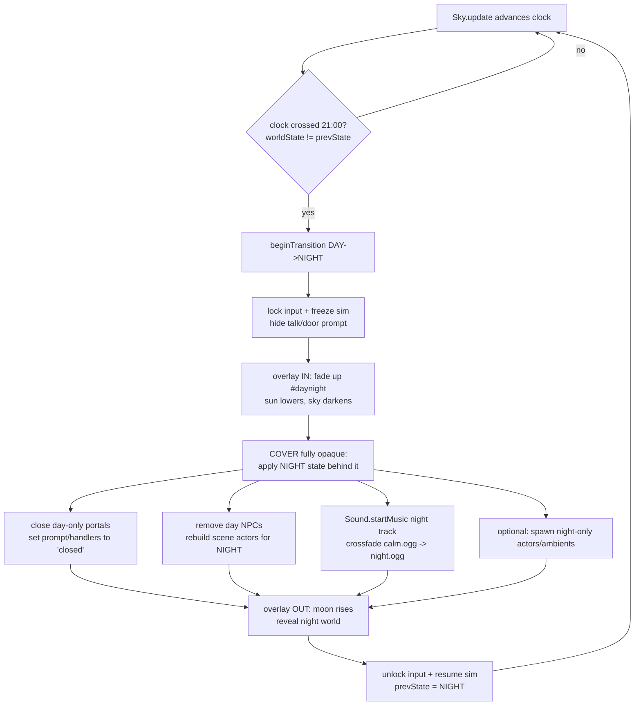

# Day / Night World States — design & implementation brief

> **Read this before doing any day/night work.** It is the reusable design package for a
> gameplay-affecting Day/Night system: definitions, state transitions, gating rules, the
> transition "loading" curtain, audio swap, data model, asset inventory, test cases, and
> open questions. It is grounded in the seams that already exist (file:line refs below) so a
> future Claude builds *on top of* them and does not rebuild the wheel.
>
> Status: **IMPLEMENTED** (this branch). See the "AS BUILT" section directly below for what
> shipped and the design choices made. The sections after it are the original design brief,
> kept as the rationale + reference.

---

## AS BUILT (what shipped)

Built on top of the existing cosmetic cycle in `studio/js/sky.js` (untouched). All in
`studio/game.html` + `studio/js/audio.js` + `studio/specs/world.json`.

- **State (`game.html`):** `isNight()` = `Sky.clock().h24>=21 || <7`; `worldState()` →
  `'DAY'|'NIGHT'`. `schedOpen("day"|"night"|[a,b])`, `isOpen(portal)`, `isActive(npc)`,
  `effectiveTrack(spec)`. `maybeBeginDayNight()` edge-detects the 21:00/07:00 crossing each free
  frame in `frame()`; `applyWorldState()` reflects state without a curtain (scene build / load /
  snap) by toggling NPC visibility + crossfading to the effective music track.
- **Curtain (`game.html`):** `beginDayNight(to)` + `updateDayNight(dt)` drive a `#daynight`
  DOM overlay (`#dnSky` gradient band + `#dnSun`/`#dnMoon` discs + `#dnLabel`). `DN_DUR=1.9s`,
  opacity trapezoid (cover→hold→reveal); the door/NPC/music swap happens **at full cover** (g≥0.42)
  so it is concealed. It owns the loop while active (sim frozen, input locked), like the portal
  transition. Deterministic on `dt` (preview rAF is suspended).
- **Chosen variant — continuous sky + concealing overlay (R1-leaning), NOT a frozen sky.** The
  existing `sky.js` cycle keeps running (time source for the clock HUD + ambience); the curtain is
  a screen-wide sun-down/moon-up beat that **conceals** the door/NPC/music swap. Freezing the
  cosmetic cycle (strict R2) was rejected: it would degrade the existing high-quality arc and break
  the clock-HUD ↔ `Sky.clock()` coupling, and the overlay already delivers the "the animation is
  the transition" requirement. At 21:00 the real sky is genuinely at dusk→night, so reveal is
  consistent.
- **Interactions (`game.html`):** closed door → prompt `🔒 <label> — closed`, action button
  `closed 🔒`, and the action fires `showClosed(p)` (a `#qtoast` + `locked` sfx) instead of the
  scene swap. `startPortal()` also hard-guards `!isOpen(p)`.
- **Closing a shop ON the player (you're inside when 21:00 hits):** handled. A shop "closes at
  night" iff the town portal leading into it is schedule-gated (`townPortalFor`/`insideClosingShop`,
  single source of truth). (1) A **pre-close heads-up** toast fires ~20:45, once per day, in
  `updateClock` — tailored if you're inside one (`"The Gym closes at 9 p.m. — head out soon!"`)
  else generic (`"The shops close at 9 p.m."`). (2) At the 21:00 curtain, `updateDayNight`'s
  full-cover swap calls `closingExitSpawn()`; if you're inside a now-closed shop it **ejects you to
  town in front of that door** (async `swapScene('town', <exit spawn>)`, the curtain *holds* at full
  cover via `dnTrans.holding` until the swap lands), then on reveal shows the door's `closedMsg`
  (`"The gym is shut for the night…"`). So you're never stranded inside a closed shop. Tested in
  `qa/scenarios/day-night-eject.mjs`. (Time is ephemeral, so reloading can never strand you either.)
- **NPCs:** hidden + non-talkable when `!isActive`. Mechanism is wired + checked, but **town has no
  street NPCs today** (Chrees is in the gym, Adrian in the pet shop), so "people off the streets"
  is latent — drop in a `world.json` npc with `"active":"day"` to see it. Indoor NPCs are
  unscheduled (and unreachable at night anyway, since the shops are closed).
- **Clock = a stylized Pikmin-style day/night BAR (`game.html`), replaces the old analog clock.**
  Top-center `#daybar`: one continuous cycle (NOT a 12h face) — left end = day-start (07:00), right
  end = night-end (07:00 next). The background is a **gradual full-day sky gradient** (dawn → bright
  day → golden → dusk → starry night, **no hard line**). Soft **clouds** sit on the day half,
  **twinkling stars** on the night half. A big **rayed sun** marker (slowly spinning) rides
  left→right and **morphs into a glowing moon** across dusk into night. A subtle dashed hairline +
  `☾` glyph (`#daybarTick`, positioned from `DB_T`) marks where night begins — an identifier, not a
  hard colour edge. Driven by `updateDayBar()` each frame (marker glides) off `Sky.phase`; clouds/
  stars/tick built in `initDayBar()` from `DB_DAYSTART`/`DB_T`. Debug: `window.__dayBar()`.
- **HUD chrome is mobile-only; the key-hint is gone.** The top-right explanation (`#hint`) is removed
  entirely. The on-screen touch controls — d-pad, action button, journal `📖`, fullscreen — show
  **only on touch devices**; on desktop (`body.desktop`, set by `applyInputMode()` from `isTouch()`,
  reactive to pointer changes) they're hidden (keyboard plays the game). The day bar shows on both.
  Force for preview/QA: `window.__forceInputMode('desktop'|'touch'|'auto')`. Guarded by
  `checks/hud-visibility.mjs`; captured in `qa/scenarios/hud-daybar-shots.mjs`.
- **Audio (`audio.js`):** new procedural SFX `dusk` / `dawn` (transition) + `locked` (closed
  door). New overworld night loop `out/music/night.ogg` (MusicGen-**small**, CPU — medium
  SIGKILL'd on this machine's MPS; small is plenty for a calm loop), wired via `spec.nightMusic`.
- **Data (`world.json`):** `nightMusic` + `hours:"day"` + `closedMsg` on the pet-shop & gym
  portals. Additive — **no `SAVE_VERSION` bump** (time is ephemeral; not persisted — see open Q4).
- **Debug/QA hooks (`game.html`):** `window.__worldState()`, `__dnState()`, `__forceTime(h)`
  (snap state, no curtain), `__triggerDayNight('DAY'|'NIGHT')` (force the curtain, clock-synced),
  plus `game.forceTime(h)` / `game.dn()`.
- **Tests:** deterministic `studio/qa/checks/day-night.mjs` (state at boundaries, shop gating,
  music selection) + end-to-end `studio/qa/scenarios/day-night.mjs` (closed-door message, natural
  21:00 curtain + music swap) + `studio/qa/scenarios/day-night-shots.mjs` (visual capture).
- **Not done / follow-ups:** time persistence across reload (Q4 — left ephemeral); dusk/dawn
  gameplay sub-states (Q2); actual night-only street actors (Q6); a dedicated MusicGen-**medium**
  night track if the small one ever reads thin.

---

## 0. TL;DR

- The world already has a **continuous cosmetic day/night cycle** (`Sky` in `studio/js/sky.js`):
  a sun + moon arc, a warm→indigo palette, stars, a wall clock (`Sky.clock()`), 24 real-minute
  day (`Sky.dayLength=1440`). It runs on a wall clock even while paused.
- This brief adds a **discrete gameplay state** — `DAY` vs `NIGHT` — *derived from that clock*,
  that gates the world: at night, **shop/gym doors are closed** (interacting yields a "closed"
  message), **NPCs leave the street**, and the **overworld swaps to a distinct night music track**.
- **Night = 21:00 → 07:00.** ⚠️ This is **NOT** the existing `Sky.clock().isDay` flag (which is
  06:00–18:00). Define a new `isNight()`; do not piggyback on `isDay`.
- At each boundary the game plays a **screen-wide "loading" curtain** (sun sinks / moon rises)
  that **conceals the swap** of doors + NPCs + music, so the player never sees the raw change.
- Everything stays **programmatic / on-aesthetic** (locked art direction): the curtain animation
  reuses the existing procedural sun/moon textures — **no hand-authored frame assets**. The *only*
  new binary asset is one **MusicGen-generated** night loop (`out/music/night.ogg`).

---

## 1. What already exists — reuse, do not rebuild

| Capability | Where | What to reuse |
|---|---|---|
| Wall clock + time-of-day | `studio/js/sky.js:388` `Sky.clock()` | Returns `{h24, m, h12, ampm, isDay, hhmm, hourDeg, minDeg}`. **Source of truth for the gameplay state.** |
| Day phase | `sky.js:124` `Sky.phase` (0..1), `Sky.dayLength` (s) | `phase 0=sunrise/06:00, .25=noon, .5=sunset/18:00, .75=midnight`. Mapping: `t = (phase*24+6)%24`. Advances in `Sky.update(dt,cam)` (`sky.js:226`) on the wall clock — **runs even while paused**. |
| Set / read time | `sky.js:396` `Sky.setTime(p)` / `getTime()` / `setDayLength(s)` | Debug + scripted control; exposed as `game.time(p)` / `game.dayLength(s)` (`game.html:2581`). |
| Sun / moon textures | `sky.js:98` `sunTex()`, `sky.js:103` `moonTex()` | Procedural canvas discs — the curtain animation should reuse these, not new PNGs. |
| Clock HUD | `game.html:1945` `updateClock()` (`#clock` svg) | Already tints to night (`.night` class) when `!isDay`. The Day/Night badge can hang off the same refresh. |
| Scene system | `game.html` `SPECS` map, `buildScene(spec,spawn)` (`:1831`), `clearScene()`, `swapScene()` (`:1566`), `curScene` | Each scene is a JSON spec with `music`, `portals[]`, `npcs[]`, `ambients[]`, `interior`, `bounds`, `spawn`, `spawns{}`. |
| Per-scene music | `game.html:1856` `Sound.startMusic(spec.music||'out/music/calm.ogg', …)` | `Sound.startMusic(url)` crossfades to a **different** url, **no-ops** on the same one, caches decoded buffers by url. `Sound.musicPlaying`. (`studio/js/audio.js:414`) |
| Scene-swap **curtain** | `game.html:1900` `startPortal()` → `updateTransition()` (`:1908`) | A 3-phase (`in`/`swap`/`out`) cream-fade state machine using the `#fade` overlay (`game.html:27`) + `transShenScale`. **The day/night curtain is a sibling of this** — same overlay-conceals-a-swap pattern. |
| Door / portal interaction | `portals[]`, `nearPortal` (`:601`), prompt `#talkPrompt` (`:2055`), action key → `startPortal(nearPortal)` (`:2389`) | The "closed at night" gate goes **here** (prompt label + the action handler). |
| NPCs per scene | `npcs[]` (`:588`), built in `buildScene` | Removing people at night = filter/hide these by state. |
| Save | `studio/js/save.js`, `SAVE_VERSION=3` | **Time is NOT persisted today** (cycle is ephemeral from page load). See §8 open question on whether to add it. |
| Procedural SFX | `studio/js/audio.js` `SFX` map + `CFG.sfx` | Add the night-transition whoosh/chime here; **do not** add an asset file for SFX. |

---

## 2. Design Document — "Day/Night World States"

### 2.1 Definitions

- **World state** is one of exactly two values: **`DAY`** and **`NIGHT`**.
- **Night hours: 21:00 (9:00 p.m.) up to 07:00 (7:00 a.m.).** Day hours: 07:00 up to 21:00.
- The state is **derived from the clock**, never stored as the primary truth:

  ```js
  // night = 9pm .. 7am  (wraps midnight). h24 is 0..23 from Sky.clock().
  function isNight(){ const h = Sky.clock().h24; return h >= 21 || h < 7; }
  function worldState(){ return isNight() ? 'NIGHT' : 'DAY'; }
  ```

  In phase units the night window is `phase >= 0.625 || phase < 0.0417` (because
  `21:00 → phase 0.625`, `07:00 → phase ≈ 0.0417`). **Prefer reading `h24`** — it is robust and
  reads like the spec.

> ⚠️ **Do not reuse `Sky.clock().isDay`** for gameplay. `isDay` is `phase < 0.5` = **06:00–18:00**
> (a *sky* concept: sun above horizon). The gameplay night is **21:00–07:00**. They deliberately
> differ: 18:00–21:00 is visually dusk/dark but shops are still **open**; 06:00–07:00 is visually
> light but shops are still **closed**. Two separate concepts, two separate flags.

### 2.2 State transitions

The state flips when the clock **crosses** a boundary (21:00 or 07:00). Detect the *edge*, not the
level (same discipline as `audioStep` firing on transitions): keep `prevState`, compare each frame
(or each clock-minute tick in `updateClock`), and when `worldState() !== prevState` fire the
transition. Time advances naturally via `Sky.update` (10 in-game night hours ≈ **10 real minutes**
of every 24-minute day), so boundaries arrive on their own — no timer needed.

```
prevState ── clock crosses 21:00 ──▶ beginTransition(DAY→NIGHT)
prevState ── clock crosses 07:00 ──▶ beginTransition(NIGHT→DAY)
```

`beginTransition` runs the **curtain** (§3): lock input → animate sun-down/moon-up over a
full-screen overlay → **behind the cover** apply the new state (doors, NPCs, music) → reveal →
unlock input → `prevState = newState`.

### 2.3 Gating rules (data-driven)

Each gateable thing carries an **open schedule** in its scene spec; the engine asks
`isOpen(thing)` against the current state. Keep it declarative so new locations need *data*, not code.

- **Default:** a portal with no schedule is **always open** (back-compat — every existing door
  keeps working).
- **`"hours": "day"`** → open only when `worldState()==='DAY'`. **`"hours": "night"`** → night only.
- **`"hours": [open, close]`** (24h ints, may wrap) → open when `open <= h < close`
  (or the wrap form). Lets a future bakery open 05:00–14:00 without new code.

```js
function isOpen(spec){
  const h = spec.hours;
  if (h == null) return true;                 // unscheduled = always open
  if (h === 'day')   return !isNight();
  if (h === 'night') return isNight();
  if (Array.isArray(h)){ const [a,b]=h, hr=Sky.clock().h24;
    return a<=b ? (hr>=a && hr<b) : (hr>=a || hr<b); }   // wrap support
  return true;
}
```

**Rules of enabling/disabling by state:**

| Element | DAY | NIGHT |
|---|---|---|
| Pet shop door (`hours:"day"`) | enterable | **closed** → closed-message, no scene swap |
| Gym door (`hours:"day"`) | enterable | **closed** → closed-message, no scene swap |
| Street NPCs (`active:"day"`) | present | **absent** (not built / hidden) |
| Overworld music | `spec.music` (`calm.ogg`) | `spec.nightMusic` (`night.ogg`) |
| Interior music | `spec.music` (`shop.ogg`) | unchanged (rooms are time-agnostic; see §8) |
| Collectibles / quests | unchanged unless a goal opts in | unchanged unless a goal opts in |
| A future "night only" element (`hours:"night"`) | hidden/closed | active |

---

## 3. The transition curtain (flowchart + step-by-step)

### 3.1 Concept

At a boundary the game enters a brief **loading state**: a screen-wide overlay paints the sky
moving (sun sinks below a horizon line / moon rises, or vice-versa for dawn), the world is frozen
and input is locked, and **under the cover** the scene quietly re-applies for the new state. The
player sees a clean "night falls" beat, never the doors snapping shut or NPCs vanishing.

Reuse the **portal curtain pattern** (`#fade` overlay + a small `trans`-like state machine), but
the overlay is a dedicated `#daynight` layer that draws the sun/moon (procedural textures from
`sky.js`) animating across a gradient band. **Duration ≈ 1.6–2.2 s** (in ~0.5s, hold/swap mid,
out ~0.6s) — long enough to read, short enough not to nag.

### 3.2 Flowchart (Day → Night at 21:00)



`Night → Day at 07:00` is the mirror: dawn animation (moon sets / sun rises), reopen day-only
portals, rebuild day NPCs, crossfade `night.ogg → calm.ogg`.

### 3.3 Step-by-step

1. **Detect.** In `updateClock()` (or a dedicated `worldStateStep`) compute `worldState()`; if it
   differs from `prevState`, call `beginTransition(prevState, next)`.
2. **Enter loading state.** Set a `dayNight` state object (mirrors `trans`). Lock movement +
   interaction (gate `resolveInput` like a portal transition does), hide `#talkPrompt`, drop held
   keys. The sim should hold (Shen idles); the cosmetic `Sky.update` may keep running or be paused
   for the duration (your call — see R1/R2 in §8).
3. **Animate (cover up).** Fade in `#daynight`; drive the sun disc downward past a horizon line and
   the sky band from warm to indigo. Play a soft `dusk` whoosh SFX (procedural, non-spatial UI sound).
4. **Swap at full cover.** When the overlay is opaque, apply the new state atomically:
   re-evaluate every portal's `isOpen`, rebuild/hide NPCs for the new state, and call
   `Sound.startMusic(effectiveTrack(curScene))` to crossfade the music. (If you also want a *hard*
   visual switch, snap `Sky.setTime()` to the night phase here — see R2 in §8.)
5. **Reveal.** Moon rises into the band; fade `#daynight` back out; a soft `nightfall` chime.
6. **Exit loading state.** Unlock input, resume the sim, set `prevState = next`, persist if time is
   saved (§8).

> The whole thing is **engine-driven and concealed** ("the user is not shown the raw transition
> details"): only the curtain animation + clock are visible; the door/NPC/music changes happen at
> full opacity.

---

## 4. Gameplay / UX behaviour

### 4.1 Interactions at night (closed shops / restricted areas)

The cleanest gate is at the **portal interaction seam**, two touch-points:

- **Prompt label** (`game.html:2060`): when `!isOpen(nearPortal)`, show **`🔒 <Label> — closed`**
  instead of `🚪 Enter <Label>`, and relabel the action button (`bLbl`, `:2067`) to `closed 🔒`.
- **Action handler** (`game.html:2389`, and guard inside `startPortal()` `:1900`): if the portal is
  closed, **do not** start the scene-swap. Instead show the **closed message** (a `#qtoast`-style
  popup, or a one-line `Dialogue` beat) and play a soft `denied`/`locked` SFX. No transition, no
  state change.

```js
// at the action site (game.html ~:2389)
else if (nearPortal){
  if (!isOpen(nearPortal)) { showClosed(nearPortal); Sound.sfx('locked'); }
  else startPortal(nearPortal);
}
```

Closed copy lives in the spec (`portal.closedMsg`) so it is per-door and translatable; fall back to
a generic line.

### 4.2 Example interactions

**Player walks up to the pet shop at 23:00 and presses the action key:**

- Prompt over the door reads: `🔒 Pet Shop — closed`
- Action button reads: `closed 🔒`
- On press, a small popup (no scene change):
  > **The pet shop is closed for the night.** The lights are off and the door is locked. *(Come back after 7 a.m.)*
- SFX: a soft `locked` click. The world stays put.

**Gym at 02:00:**
- Prompt: `🔒 Gym — closed`
- Popup: **The gym is shut for the night.** A note on the glass reads "Open 7-9. See you in the morning!"

**Same door at 10:00 (day):** prompt `🚪 Enter the Pet Shop`, action enters normally — unchanged from today.

### 4.3 People & activity, day vs night (optional but recommended)

- **Day:** street NPCs present (as today). Tag each street NPC with `"active": "day"`.
- **Night:** day NPCs are absent (off the streets). Optionally add a **small** set of night-only
  flavour actors (`"active": "night"`) — e.g. a lamplit cat, a single night-owl NPC — for life,
  not clutter (stay on the calm-negative-space aesthetic). Reuse the existing billboard NPC
  pipeline; no new system.
- Implementation: `buildScene` filters `spec.npcs` by `isActive(npc)` (mirrors `isOpen`), and the
  transition rebuilds the actor set behind the curtain.

### 4.4 Audio

- **Distinct night street music.** Overworld day = `out/music/calm.ogg` (exists). Overworld night =
  **new** `out/music/night.ogg`. The active overworld track is
  `effectiveTrack = isNight() && spec.nightMusic ? spec.nightMusic : spec.music`.
- Switched two ways, both via `Sound.startMusic` (crossfades, no-ops on same url):
  1. on a **scene build** (`game.html:1856`) — use `effectiveTrack` instead of raw `spec.music`;
  2. on a **state flip while staying in the scene** — the curtain's swap step calls
     `Sound.startMusic(effectiveTrack(curScene))`.
- **Interiors are time-agnostic** by default: the pet shop / gym keep `shop.ogg` regardless of
  state (you're inside; you can't see night). They *can* opt into a night variant later via
  `nightMusic`, but the doors are closed at night anyway so it rarely matters.
- **Per the sound rules in CLAUDE.md:** the night track must be a **seamless MusicGen loop**
  (`gen_music.py` → `make_loop.py`, verified gapless via the OfflineAudioContext wrap check), soft
  + calm + on-aesthetic, exclusive to the overworld. The transition SFX (`dusk` whoosh,
  `nightfall`/`dawn` chime, `locked` click) are **procedural** in `audio.js` (no asset files),
  non-spatial UI sounds.

---

## 5. Data model

### 5.1 Runtime state object

```js
// single source of gameplay time-state; derived, cached for edge detection
const World = {
  state: 'DAY',          // 'DAY' | 'NIGHT' — = worldState() last applied
  prevState: 'DAY',      // for boundary edge detection
  transition: null,      // null, or { dir:'toNight'|'toDay', phase:'in'|'swap'|'out', t }
};
```

### 5.2 Scene-spec additions (JSON, additive — back-compat)

```jsonc
{
  // ... existing scene fields ...
  "music":      "out/music/calm.ogg",      // day overworld (existing)
  "nightMusic": "out/music/night.ogg",     // NEW: night overworld track (absent → reuse music)

  "portals": [
    { "id": "to_petshop", "x": 8.2, "z": -1, "to": "petshop", "spawn": "from_town",
      "label": "the Pet Shop",
      "hours": "day",                                  // NEW: gating schedule
      "closedMsg": "The pet shop is closed for the night. Come back after 7 a.m." }
  ],

  "npcs": [
    { "name": "Chrees", "active": "day",  /* ... */ },  // NEW: presence schedule
    { "name": "NightCat", "active": "night", /* ... */ }
  ]
}
```

`hours` / `active` accept `"day"`, `"night"`, or `[openHr, closeHr]` (24h, wrap-aware); absent =
always on. **No `SAVE_VERSION` bump** for these (they are world data, not save fields).

### 5.3 Night-music asset reference

| Field | Value |
|---|---|
| **Title** | "Quiet Streets" (working name; night overworld loop) |
| **Artist / source** | Procedurally generated with **MusicGen-medium** (CPU), via `studio/gen_music.py` → `studio/make_loop.py`. Not hand-authored (matches `calm.ogg` / `shop.ogg`). |
| **File path** | `studio/out/music/night.ogg` (committed; small OGG, like the others) |
| **Trigger** | `worldState() === 'NIGHT'` **AND** active scene is the overworld (street) → `Sound.startMusic('out/music/night.ogg')`, fired from the scene build (`effectiveTrack`) and from the state-flip swap step. |
| **Constraint** | Seamless loop (equal-power tail-over-head crossfade), wrap discontinuity verified ≤ adjacent-sample-delta distribution; soft/calm/warm; exclusive to the overworld. |

### 5.4 Rule evaluation summary

```
isNight()         := Sky.clock().h24 >= 21 || < 7
worldState()      := isNight() ? NIGHT : DAY
isOpen(portal)    := schedule(portal.hours)  // default true
isActive(npc)     := schedule(npc.active)     // default true
effectiveTrack(s) := isNight() && s.nightMusic ? s.nightMusic : s.music
transition fires  := worldState() != World.prevState   // on the boundary edge
```

---

## 6. Asset inventory

> Locked art direction = **programmatic, no hand-authored assets.** The user's request mentions
> "animation frames for sun/moon" and "loading screen visuals" — for THIS project those are
> produced procedurally, not as image files. Inventory reframed accordingly:

| Asset | Type | Source / how | New file? |
|---|---|---|---|
| Sun / moon discs for the curtain | Procedural canvas texture | Reuse `sunTex()` / `moonTex()` from `sky.js:98` | No |
| Curtain sky band / gradient | CSS/canvas gradient in `#daynight` overlay | Drawn in code (warm→indigo), reuses `Sky` palette stops | No |
| "Night falls" / "Dawn" lettering (optional) | DOM text in the overlay | CSS text, no image | No |
| **Night street music loop** | OGG audio | **MusicGen** `gen_music.py` → `make_loop.py` → `out/music/night.ogg` | **Yes (only new binary)** |
| `dusk` whoosh, `nightfall`/`dawn` chime, `locked` click | Procedural Web Audio | New entries in `SFX` map + `CFG.sfx` in `audio.js` | No |
| Night-only flavour actor art (optional) | Papercraft billboard | `papercraft-asset` skill (Gemini → cutout) if added | Only if §4.3 night actors are added |

So a complete implementation needs to **generate exactly one new asset file** (`night.ogg`);
everything else is code.

---

## 7. Testing notes

Follow the QA reflex (CLAUDE.md): every rule below should become a **deterministic check** in
`studio/qa/checks/*.mjs` (auto-discovered by `qa_audit.mjs`) plus a `window.__*` probe where needed,
not just a manual test. Add a `window.__worldState()` / `__forceTime(h)` debug hook to make these
testable headlessly.

**Transition timing**
- Setting the clock to 20:59 then advancing past 21:00 fires exactly one `DAY→NIGHT` transition
  (edge-detected, not re-fired every frame while it stays night).
- Crossing 07:00 fires exactly one `NIGHT→DAY` transition.
- No transition fires for clock moves that stay within a state (e.g. 22:00→23:00).
- `worldState()` is `NIGHT` at 21:00, 00:00, 06:59; `DAY` at 07:00, 12:00, 20:59 (boundary inclusivity).

**Loading sequence**
- During the transition, input is locked (movement + interaction no-op) and the `#daynight`
  overlay reaches full opacity before any door/NPC/music swap is observable.
- The overlay fades fully out and input unlocks within the configured duration (no stuck curtain).
- Transition is re-entrant-safe: a second boundary cannot start while one is running.
- `Sound.startMusic` is called with the night/day track exactly once per flip (spy on `window.audio`
  as in `qa_audio.mjs`); crossfade target = `night.ogg` on `DAY→NIGHT` in the overworld.

**Gated interactions**
- At night, `isOpen(petshopPortal)` and `isOpen(gymPortal)` are `false`; the action key shows the
  closed message and does **not** change `curScene`.
- At day they are `true` and entering still works (no regression to existing portal flow).
- A portal with no `hours` is always open in both states (back-compat).
- `[open,close]` wrap schedules evaluate correctly across midnight.

**Presence**
- Day-only NPCs are absent from the built scene at night; night-only actors absent by day.
- Camera/abyss/overlap audits still pass with the night actor set (run the full world QA gate).

**Audio**
- `night.ogg` loop is seamless (OfflineAudioContext wrap-discontinuity check, per CLAUDE.md).
- Overworld plays `calm.ogg` by day, `night.ogg` by night; interiors unaffected; no track bleeds
  across a scene change.

**Save (if time is persisted — §8)**
- Reload mid-night restores `NIGHT` state and the closed doors / night music without a visible
  flash of the wrong state.

---

## 8. Open questions (decide before building)

1. **Hard switch vs the existing smooth dusk/dawn? (the key fork)**
   The engine *already* renders continuous dusk/dawn (palette stops at `dusk`/`pre-dawn` in
   `sky.js:34`). Two ways to reconcile that with the requested 9 p.m. beat:
   - **R1 — Continuous sky + dramatized curtain (less work, keeps the lovely cycle).** Let the sky
     keep cycling smoothly; the 21:00 curtain is a *gating beat* (its sun-down/moon-up animation is
     stylized, not literal) whose real job is to conceal the door/NPC/music swap.
   - **R2 — Hard switch tied to the curtain (matches the request most literally).** Freeze/clamp the
     cosmetic cycle so the sky only visibly changes *during* the curtain: the animation literally
     lowers the sun + raises the moon, then snaps `Sky.setTime()` to night. Requires decoupling the
     cosmetic advance from real time. **Recommended if the user wants the animation to *be* the
     day→night visual** (their wording leans this way).
   *Recommendation: R2 for fidelity to the brief; R1 if we want to ship fast and preserve the
   current ambience.* This is a user-facing taste call.
2. **Dusk / dawn partial states?** The brief asks. The cosmetic engine gives them free. Do we want
   *gameplay* sub-states (e.g. a "closing soon" warning 20:30–21:00), or only the two hard states
   with a transition animation between? Default: two states + animation; no gameplay sub-states.
3. **Time progression edge cases.**
   - **Pause:** `Sky.update` runs even while paused (`game.html:1957`) — so time advances in the
     pause menu today. Should a boundary be allowed to trigger *while paused* (curtain over the
     menu), or should the clock hold while paused? Default: hold the *gameplay* clock while paused
     (don't fire transitions over a menu); let the cosmetic sky keep breathing.
   - **Time-skip / fast-forward / `game.time(p)` debug jumps:** if the clock jumps *over* a boundary
     (e.g. sleep, or `setTime`), do we still play the full curtain, or snap the state instantly?
     Default: if the jump is large/scripted, **snap state, skip the curtain**; only play the curtain
     for natural real-time crossings.
   - **Tab backgrounded:** rAF is suspended in the preview (the `setInterval` clock keeps time) — on
     refocus the clock may have crossed a boundary; treat as a scripted jump (snap, no curtain).
4. **Persist time across sessions?** Today time is ephemeral (resets to `startPhase` each load). For
   a gameplay state that gates doors, a reload at 23:00 should probably *stay* night. Options:
   (a) leave ephemeral (simplest; state re-derives from whatever phase the cycle is at on load);
   (b) add an **additive** `time` field to the save (no `SAVE_VERSION` bump — absent → default).
   *Default: leave ephemeral unless the user wants persistence.*
5. **Which locations behave differently beyond pet shop + gym?** Confirm the full list. Candidates:
   plaza fountain (off at night?), park gate, any future bakery/bar (a bar could be `hours:"night"`).
   Anything that should stay **always open** (e.g. the player's home) just omits `hours`.
6. **Night-only content?** Do we want any night-exclusive actors / events / collectibles (§4.3), or
   is night purely "shops closed + quieter + different music" for v1? Default: v1 = quieter + closed
   + music; night actors are a fast follow.

---

## 9. Implementation checklist (file-by-file, for a future session)

1. **`studio/js/sky.js`** — (R2 only) add a way to clamp/hold the cosmetic phase so the curtain can
   own the visible day→night change; otherwise no change (clock already exposes everything).
2. **`studio/game.html`**
   - Add `World` state + `isNight()/worldState()/isOpen()/isActive()/effectiveTrack()` helpers.
   - Add `#daynight` overlay element + a `dayNight` transition state machine (sibling of `trans` /
     `updateTransition`), driven each frame; lock input while active (gate `resolveInput`).
   - Edge-detect the boundary in `updateClock()` (or a `worldStateStep`) → `beginTransition`.
   - Gate the portal prompt (`:2060`) + action handler (`:2389`) + `startPortal` (`:1900`) on
     `isOpen`; add `showClosed()` (reuse `#qtoast` styling).
   - Filter `npcs` by `isActive` in `buildScene`; rebuild actor set in the curtain swap step.
   - Use `effectiveTrack(spec)` at the scene-build `startMusic` (`:1856`) and in the swap step.
   - Bump the `?v=N` cache-bust on any edited `js/*.js` import.
   - Add `window.__worldState()` / `window.__forceTime(h)` debug hooks.
3. **`studio/js/audio.js`** — add `dusk`, `nightfall`/`dawn`, `locked` to `SFX` + `CFG.sfx`.
4. **`studio/out/music/night.ogg`** — generate via `gen_music.py` → `make_loop.py` (see
   `requirements-music.txt`); verify the seam (OfflineAudioContext wrap check); commit.
5. **`studio/specs/world.json`** (+ any street scenes) — add `nightMusic`, `hours` on shop/gym
   portals, `closedMsg`, `active:"day"` on street NPCs.
6. **`studio/qa/checks/day-night.mjs`** — deterministic checks per §7 (state at boundaries,
   single-fire transition, `isOpen` gating, music selection). Add probes to `game.html`.
7. **Run the gates:** `node studio/qa_audit.mjs` (deterministic), `node studio/qa_shots.mjs` +
   `/papercraft-env-qa` sweep (night vs day screenshots), `node studio/qa_audio.mjs` (extend for
   night music + transition SFX), `/zone-camera` if any camera changes. Then `/deploy`.

---

*Cross-refs: `studio/PREMIUM_LOOK.md` (look), `CLAUDE.md` Sound + QA-gate + Save-compat sections,
`studio/qa/README.md` (how to add a check). Memory: `[[shanni-day-night-states]]`.*
